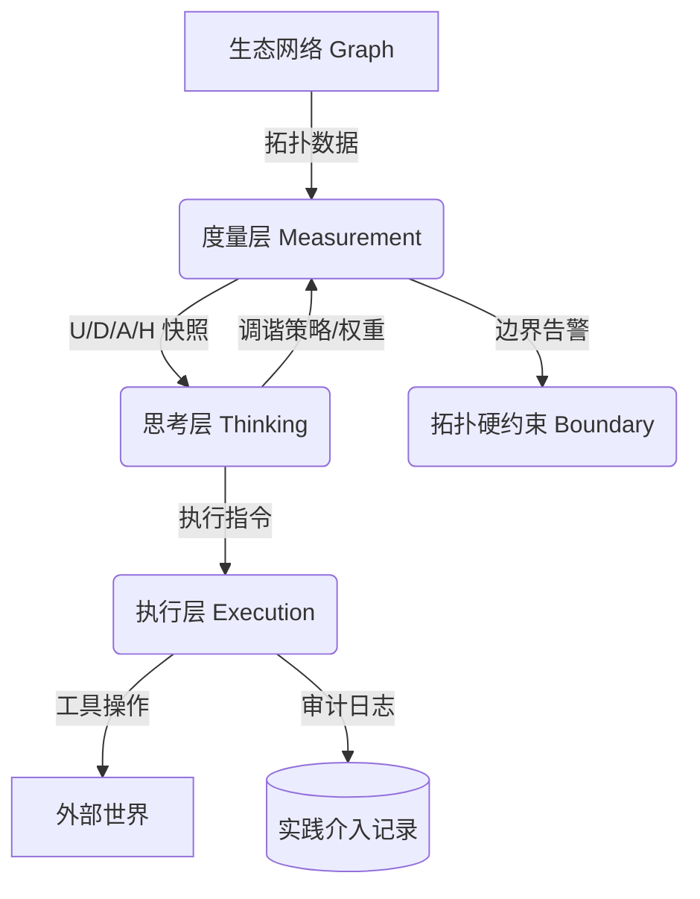

# 🧠 CrystalMind —— 赋予复杂系统“自我感知”与“安全边界”的智能内核

你的 AI Agent 是否像个鲁莽的天才，能力超群但总在危险的边缘试探？
你的大型爬虫项目，是否总在业务压力和合规风险之间疲于奔命？

**CrystalMind 为此而生。** 它不是另一个工具，而是一个**即插即用的智能安全内核**，为你的系统注入三大核心能力：

1.  **🧠 全息感知**：它能像“CT扫描”一样，实时分析系统的和谐度。它会告诉你系统现在是“高效协作”还是“即将内讧”。
2.  **🛡️ 数学级安全**：它为你的系统划定了一条**数学上的“铁轨”**。任何操作一旦试图越界，会被几何层面直接阻止，彻底杜绝“AI幻觉”带来的灾难。
3.  **⚖️ 自适应平衡**：它像一个“智能大脑”，能在系统的“创造力”和“稳定性”之间自动找到最佳平衡点。混乱时加强管控，僵化时释放活力。

## ⚡ 核心差异化优势

| 传统方式 | CrystalMind 方式 |
|----------|------------------|
| 只看最终结果，事后分析日志 | **实时四维感知 (U/D/A/H)**，系统状态一秒看清 |
| 用代码规则硬性限制，容易绕过 | **用微分流形拓扑硬约束**，从数学几何层面杜绝越界 |
| 手动调整参数，依赖经验 | **谐振引擎自动调谐 λ 权重与 τ 温度**，智能寻找最优平衡 |
| 评估依赖模拟数据或离线基准 | **基于 NetworkX 图拓扑实时计算**，真实反映关系网络健康度 |

## 🚀 5 分钟快速体验

### 方式一：故事化 Demo（推荐）

你将亲眼目睹：一个健康的数据生态被恶意节点攻击 → 和谐度崩溃 → 系统自动调谐 → 成功自我修复的全过程。

```bash
git clone https://github.com/luoxuejian000/CrystalMind.git && cd crystal_mind
pip install -e .
crystal-mind demo
```

### 方式二：可视化仪表盘

```bash
crystal-mind dashboard
```
然后打开浏览器访问 `http://localhost:8501`，你将看到实时的四维和谐度仪表盘。

### 方式三：CLI 工具

```bash
# 评估一个网络图的健康度
crystal-mind evaluate --graph examples/sample_network.json
```

## 📖 理论根基与工程映射

CrystalMind 将抽象的哲学思想，转化为了可运行的代码模块：

| 晶脉哲学公理 | 核心思想 | 工程模块与实现 |
|:---:|---|---|
| **关系本体论** | 存在即关系，性质由网络决定 | `measurement/` 度量层：基于 `NetworkX` 实时计算生态网络的拓扑健康度 |
| **矛盾动力论** | 矛盾是演化之源 | `measurement/boundary.py`：监控 `A` 值（对抗性）边界余量，触发演化动力 |
| **实践介入论** | 认知即介入 | `execution/photon_scheduler.py`：所有工具调用均有不可篡改的审计日志 |
| **谐振调谐论** | 内生动态平衡 | `thinking/resonance_engine.py`：根据 `H` 的二阶导数（相变检测）自适应调整权重 `λ` 与温度 `τ` |

## ⚙️ 架构概览



## 🛠️ 自定义配置

项目支持通过修改 `config/default_config.yaml` 来调整核心参数，例如：

```yaml
lambda_weights:
  U: 0.4  # 统一性权重
  D: 0.3  # 发展性权重
  A: 0.3  # 对抗性权重
boundary:
  A_max: 0.6  # 对抗性最大容忍度
```

## 📄 许可证

本项目基于 [Apache 2.0 许可证](LICENSE) 开源。

---

**CrystalMind —— 让智能在关系的脉络中谐振生长。**
```
